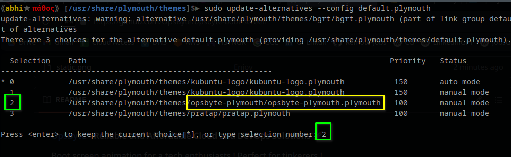

#### **[OpsByte](https://www.opsbyte.com)**  - Reliable and Affordable Cloud and DevOps Solutions 🚀  

Boot screen animation for a tech enthusiasts ! Perfect for tinkerers !  

#### Installation  

1. Run following Commands:  
```
cd /usr/share/plymouth/themes/
sudo git clone https://github.com/OpsByte/opsbyte-boot-screen.git opsbyte-plymouth
sudo update-alternatives --install /usr/share/plymouth/themes/default.plymouth default.plymouth /usr/share/plymouth/themes/opsbyte-plymouth/opsbyte-plymouth.plymouth 100
sudo update-alternatives --config default.plymouth
```
  
2. Enter number related to **OpsByte** & Press `Enter`. (Like this screenshot **2** in our case)  
  
  
  
3. Update Ram File system by following command:  
```
sudo update-initramfs -u  
```
  
4. Reboot to Test.  

#### To Uninstall  

1. Run following command  
```
sudo update-alternatives --remove default.plymouth /usr/share/plymouth/themes/opsbyte-plymouth/opsbyte-plymouth.plymouth
```
2. Select Appropriate Splash screen from list again.  
  


Thanks.  
  
👍Follow us on [Our Linkedin Page](https://www.linkedin.com/company/opsbyte) to Stay Updated !  
✅ Powered by [OpsByte Technologies](https://www.opsbyte.com)
